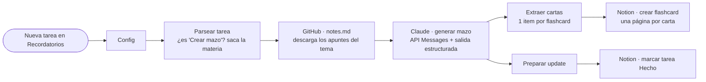

# ClinDeck · Generador de Mazos (Notion → Claude → Notion)

Workflow de **n8n** que, cuando aparece una tarea **"Crear mazo"** en tu base de
`Recordatorios` (la crea el Study Bot), **lee los apuntes del tema desde GitHub**,
llama a la **API de Claude** para generar las flashcards y las **escribe en una base
de Notion** — y marca la tarea como *Hecho*.

Archivo a importar: **`clindeck-generador-mazos.n8n.json`**

---

## El flujo (lo que vas a ver en el lienzo)

**Paso a paso:**
1. **Trigger** — `Notion Trigger` sondea la base `Recordatorios` y dispara con cada página nueva.
2. **Config** — inyecta tus parámetros (URL de GitHub, ID de la base de flashcards, modelo, nº máx. de cartas, el *system prompt*).
3. **Parsear tarea** — filtra: solo continúa si `Tipo = Crear mazo`. Extrae la **materia** del título y calcula el `slug` de la carpeta (`Antibióticos` → `antibioticos`).
4. **GitHub · notes.md** — descarga `content/<slug>/notes.md` (la fuente de verdad del tema).
5. **Claude · generar mazo** — `POST /v1/messages` a la API de Claude:
   - Modelo **`claude-opus-4-8`**, **prompt caching** en el system (ahorra en llamadas repetidas), **thinking adaptive** y **salida estructurada** (`output_config.format` con un JSON-Schema) → garantiza un `{ "cards": [{front, back}, …] }` válido.
6. **Extraer cartas** — parsea el JSON y emite **una carta por item**.
7. **Notion · crear flashcard** — crea una página por carta en tu base `Flashcards`.
8. **Preparar update → marcar tarea Hecho** — cierra la tarea original.

---

## 🔧 Lo que puedes editar (los "knobs")

| Quieres cambiar… | Dónde | Cómo |
|---|---|---|
| **De qué repo/rama lee los apuntes** | nodo **Config** → `GITHUB_RAW_BASE` | Pega tu base `raw.githubusercontent.com/.../content` |
| **A qué base de Notion escribe** | nodo **Config** → `FLASHCARDS_DB` | ID de tu base `Flashcards` |
| **El modelo de Claude** | nodo **Config** → `ANTHROPIC_MODEL` | `claude-opus-4-8` (máx. calidad), `claude-sonnet-4-6` o `claude-haiku-4-5` (más barato) |
| **Cuántas cartas genera** | nodo **Config** → `MAX_CARDS` | p.ej. `20`, `40` |
| **El tono/reglas de las flashcards** | nodo **Config** → `SYSTEM_PROMPT` | Edita las instrucciones (anti-alucinación, bilingüe, etc.) |
| **El esquema de salida / campos** | nodo **Claude · generar mazo** → `JSON Body` | El `output_config.format.schema` (añade p.ej. `mnemonic`, `level`) |
| **`max_tokens`, thinking, caché** | nodo **Claude · generar mazo** → `JSON Body` | `max_tokens: 12000`, `thinking: {type:'adaptive'}`, `cache_control` |
| **Cómo se mapean los campos a Notion** | nodo **Notion · crear flashcard** → `JSON Body` | Nombres de propiedades `Front`, `Reverso`, `Materia`, `Estado` |
| **Cada cuánto revisa tareas nuevas** | nodo **Nueva tarea (Recordatorios)** → `Poll Times` | `everyMinute`, cada 5 min, etc. |
| **Cómo detecta la materia** | nodo **Parsear tarea** (Code) | La regex `crear mazo de (…) para` |

---

## Puesta en marcha

1. **Crea una base `Flashcards` en Notion** con estas propiedades:
   | Propiedad | Tipo |
   |---|---|
   | **Front** | Title |
   | **Reverso** | Rich text |
   | **Materia** | Select |
   | **Estado** | Select (`Por revisar`, `Aprobada`) |
   Conéctale tu integración de Notion y copia su **ID**.
2. **Importa** `clindeck-generador-mazos.n8n.json` en n8n.
3. **Credenciales:**
   - **Notion API** → asígnala al Trigger y a los 2 nodos `Notion · …`.
   - **Header Auth** (para Claude): crea una credencial *Header Auth* con
     **Name** = `x-api-key` y **Value** = tu API key de Anthropic. Asígnala al nodo
     `Claude · generar mazo`.
4. **Config:** rellena `FLASHCARDS_DB`, confirma `GITHUB_RAW_BASE` (rama correcta) y
   el `REEMPLAZA_ID_BASE_RECORDATORIOS` del **Trigger**.
5. **Probar:** crea a mano una tarea en `Recordatorios` con `Tipo = Crear mazo` y
   título *"Crear mazo de Antibióticos para Parcial"* → ejecuta el workflow → revisa
   tu base `Flashcards`. Luego **actívalo**.

> 💡 Encadénalo con el **Study Bot**: ese genera las tareas "Crear mazo", y este las
> convierte en flashcards reales. Pipeline completo: exámenes → recordatorios →
> mazos automáticos.

⚕️ El contenido clínico sale de `content/<tema>/notes.md` (con fuentes). Claude solo
reformatea a flashcards; el system prompt le prohíbe inventar datos. Material educativo.
