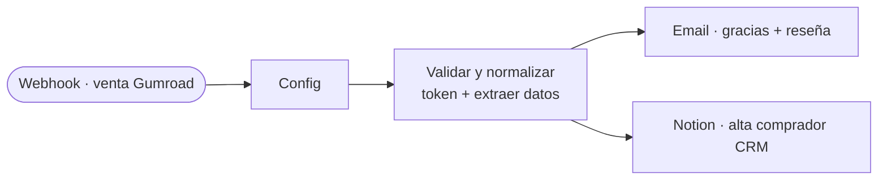

# ClinDeck · Post-venta de Gumroad (n8n)

Cuando alguien compra en **Gumroad**, este workflow:
1. 📧 le **envía un correo** de agradecimiento + petición de **reseña** + código de descuento para la próxima compra;
2. 🗂️ lo **da de alta en tu CRM de Notion** (lista de correo / embudo de retención).

Gumroad ya entrega el archivo; esto añade el **toque humano** y construye tu **base de clientes**.

Archivo a importar: **`clindeck-postventa-gumroad.n8n.json`**

---

## El flujo

---

## Puesta en marcha

### 1. Crea la base `Compradores (CRM)` en Notion
| Propiedad | Tipo |
|---|---|
| **Nombre** | Title |
| **Email** | Email |
| **Producto** | Rich text |
| **Precio USD** | Number |
| **Fecha** | Date |
| **SaleID** | Rich text |
| **Origen** | Select (`Gumroad`) |

Conéctale tu integración de Notion y copia su **ID**.

### 2. Importa el workflow y crea credenciales
- **Notion API** → nodo `Notion · alta comprador (CRM)`.
- **Gmail OAuth2** → nodo `Email · gracias + reseña` (o cámbialo por Telegram/Mailchimp).

### 3. Rellena el nodo `Config`
| Campo | Qué poner |
|---|---|
| `NOTION_CRM_DB` | ID de tu base `Compradores (CRM)` |
| `GUMROAD_URL` | URL de tu tienda Gumroad |
| `DISCOUNT_CODE` | Código para la próxima compra (créalo también en Gumroad) |
| `SHARED_SECRET` | Un texto secreto (opcional, ver paso 5) |

### 4. Copia la URL del Webhook y pégala en Gumroad
- En n8n, abre el nodo **`Webhook · venta Gumroad`** y copia la **Production URL**
  (algo como `https://TU-n8n/webhook/gumroad-sale`).
- En **Gumroad → Settings → Advanced → Ping** (o por producto, "Webhooks") pega esa URL.
- Gumroad enviará un POST con cada venta.

### 5. (Opcional) Protege el webhook con un token
- En `Config`, pon un `SHARED_SECRET` (p.ej. `cd_8f3k…`).
- En la URL del ping de Gumroad añade `?token=cd_8f3k…`.
- El nodo `Validar` ignora cualquier ping cuyo token no coincida (anti-abuso).

### 6. Activa el workflow
Haz una compra de prueba (Gumroad permite test) y verás el correo + la fila en Notion.

---

## 🔧 Lo que puedes editar

| Para cambiar… | Dónde |
|---|---|
| **Texto/diseño del correo** | nodo `Email · gracias + reseña` → `Message` (HTML) |
| **Asunto** | nodo `Email` → `Subject` |
| **Canal de aviso** (Telegram, Slack, Mailchimp) | reemplaza el nodo Gmail |
| **Campos que guarda en Notion** | nodo `Notion · alta comprador (CRM)` → `JSON Body` |
| **Código de descuento / tienda** | nodo `Config` |
| **Datos que llegan de Gumroad** | nodo `Validar y normalizar` (Code) — `email`, `full_name`, `product_name`, `price` (en centavos), `sale_id`, `sale_timestamp` |

---

## Campos que envía Gumroad (los más útiles)
`email`, `full_name`, `product_name`, `permalink`, `price` (centavos), `currency`,
`quantity`, `sale_id`, `sale_timestamp`, `order_number`, `license_key` (si activas licencias).

> Cierra el embudo de `STRATEGY.md`: Reddit → perfil → Gumroad → **este workflow** (email + CRM) → recompra.
> ⚕️ No envíes consejo clínico en los correos; es material educativo.
